# S3-MRS-Web

Demo at: [hcmut-s3-mrs-web.vercel.app](https://hcmut-s3-mrs-web.vercel.app)

<h3 align="left">Languages:</h3>

    

- Frontend: HTML, CSS, JS
- Backend: Vanilla JS
- Deploy: Vercel

A lightweight, responsive front-end for booking and checking in to smart study spaces—built with plain HTML, CSS & JavaScript and deployed on Vercel.

## Features
- Space Booking
- Reservation Management
- QR-Code Check-In
- Real-Time Status Updates
- Client-Side Authentication

## Demo

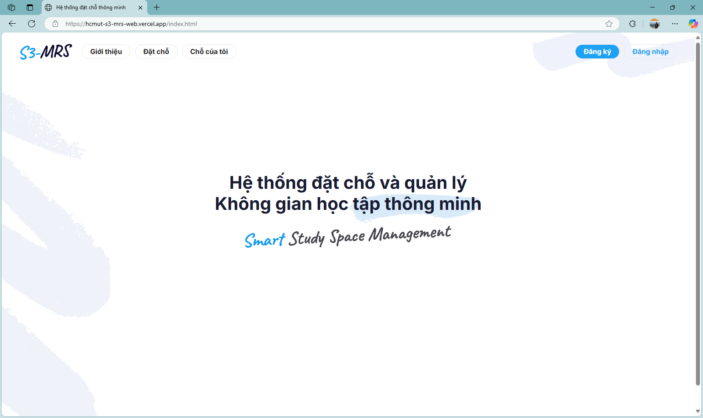  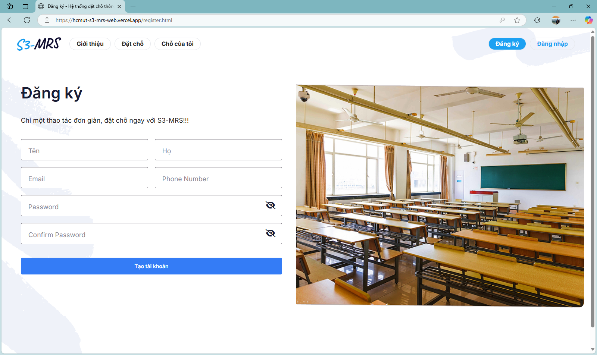 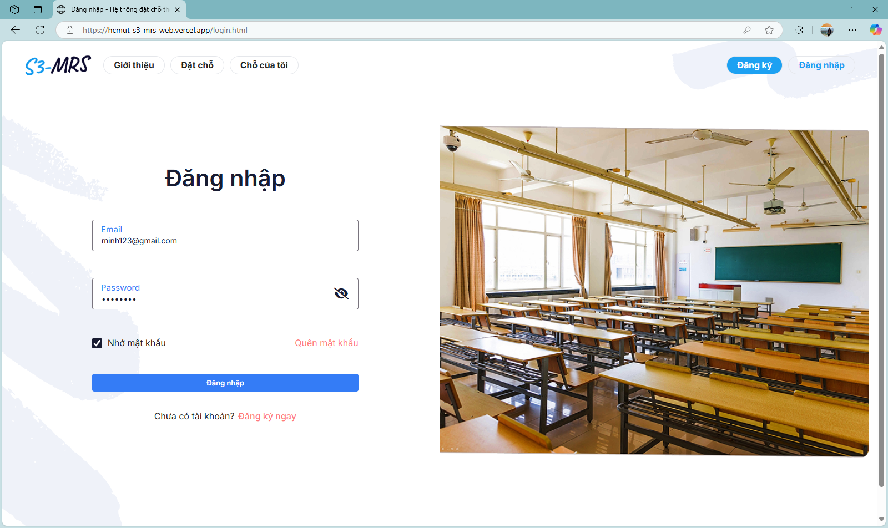 

 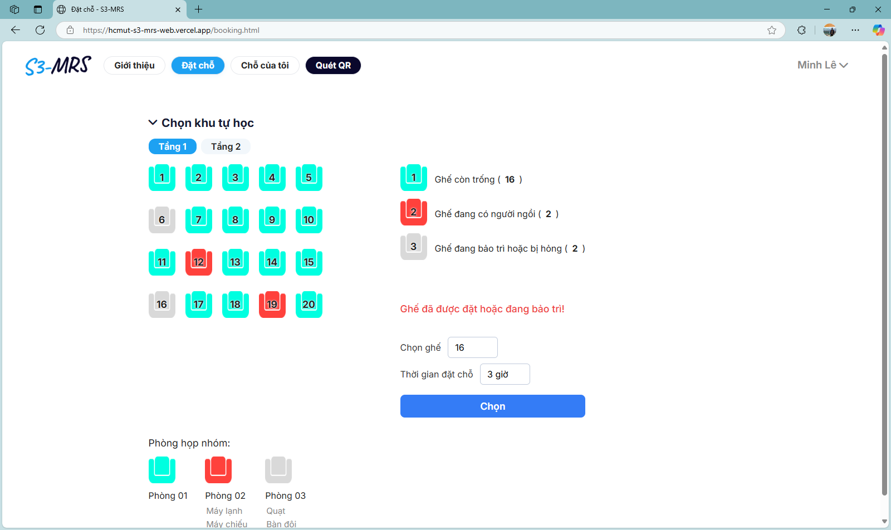 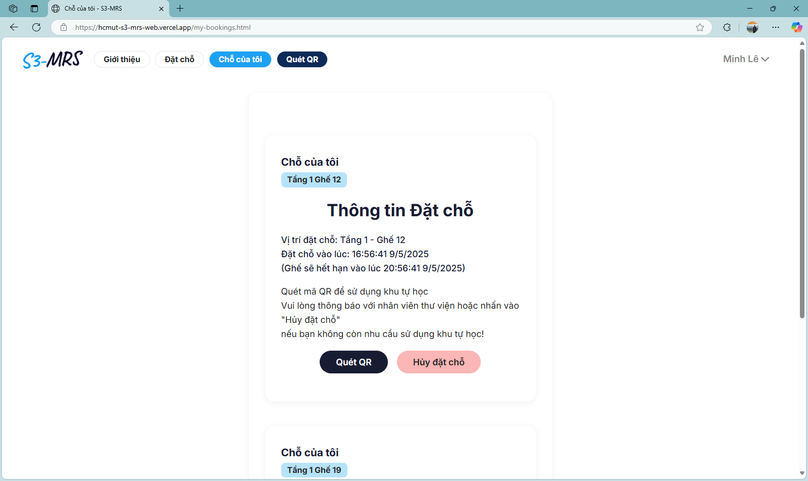  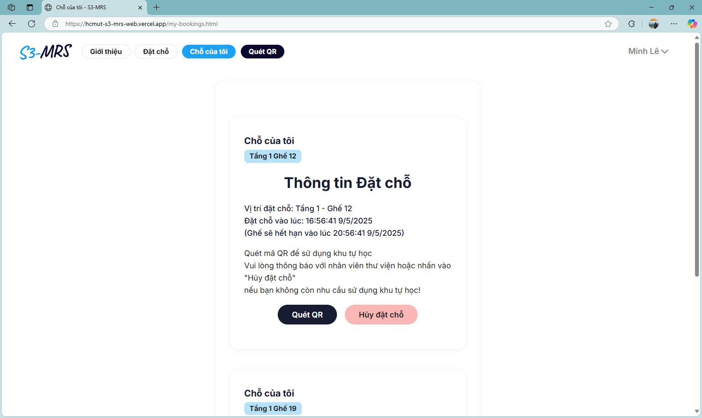 |
 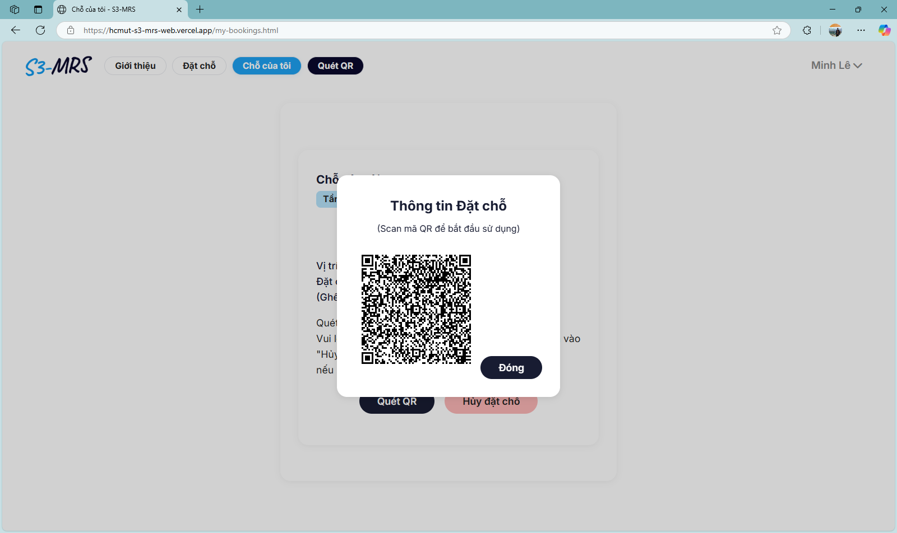  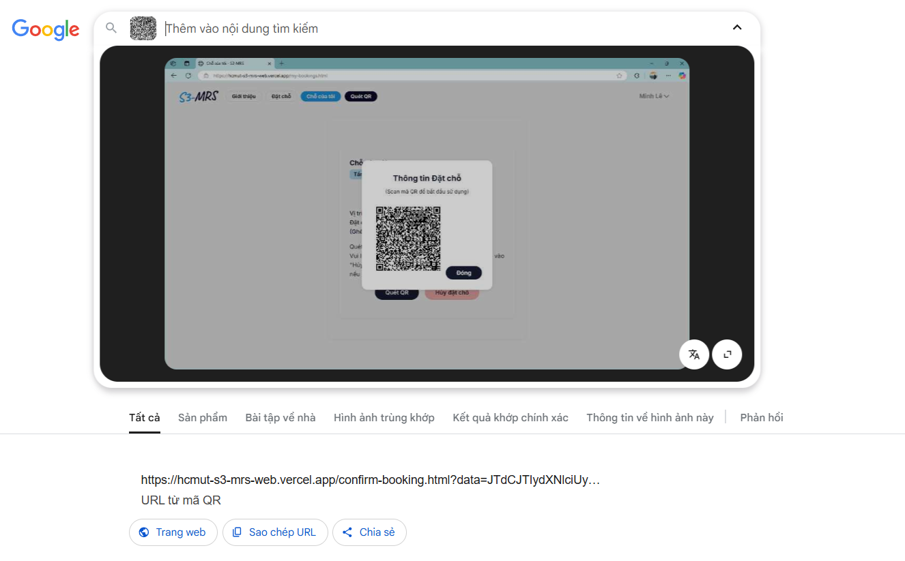  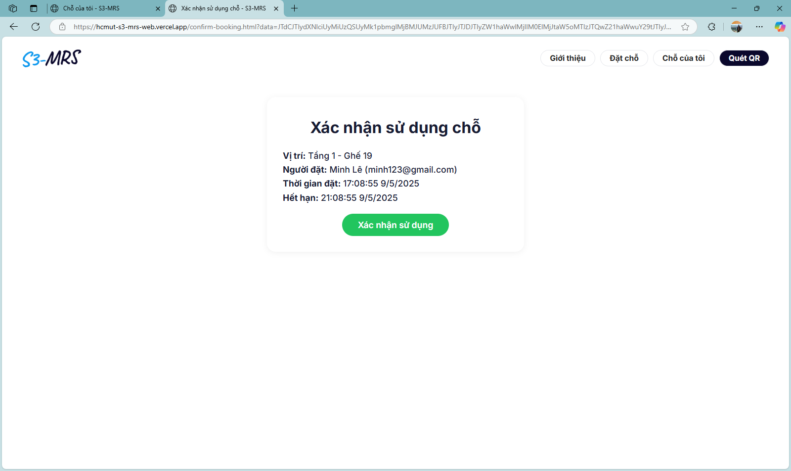  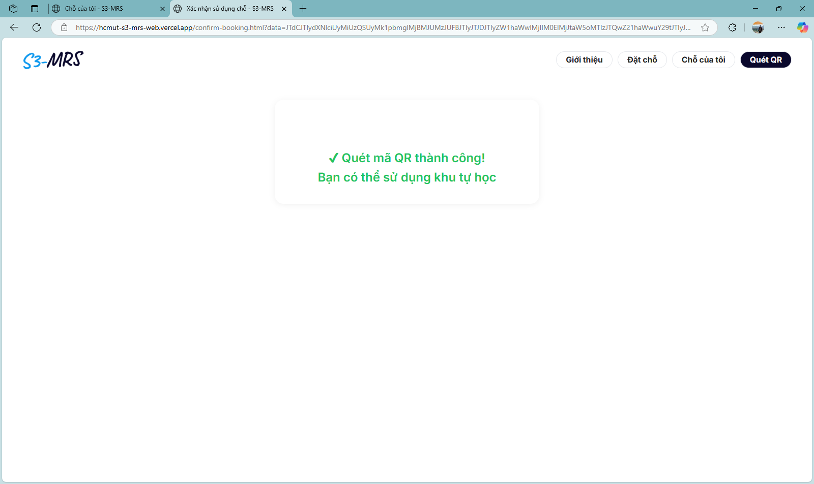 
 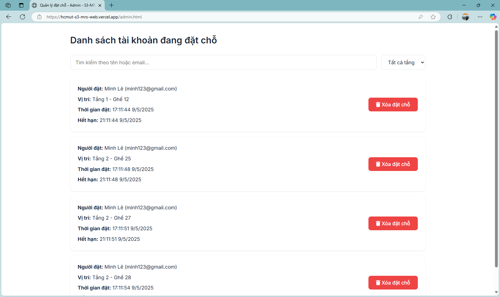 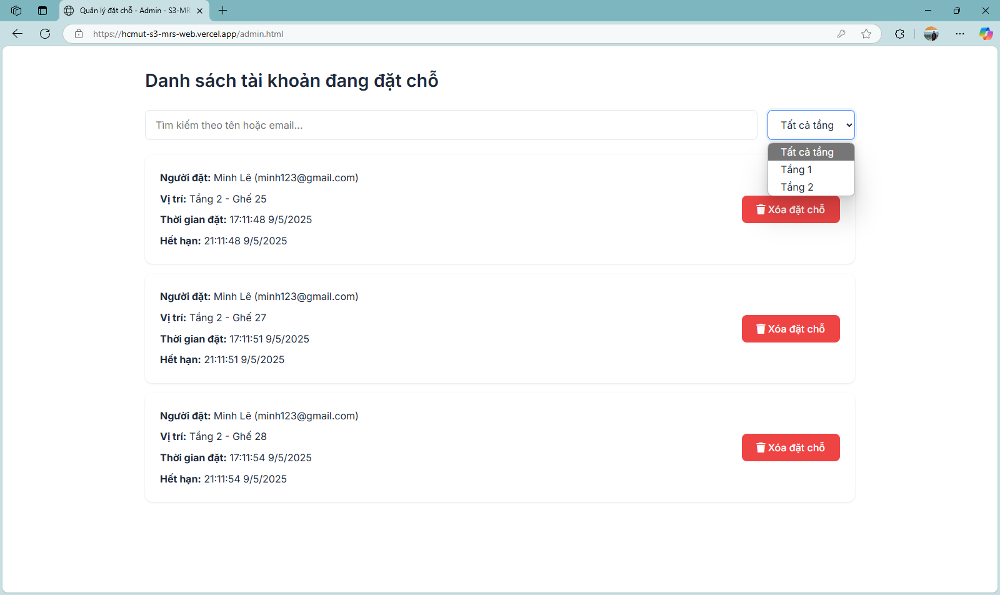 
